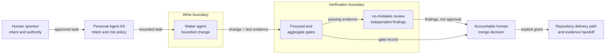

# A governed delivery loop for coding agents

## Start here

This guide is for engineering and platform leads who need coding agents to
change repositories without letting those agents approve their own work. Use it
when an agent can write useful code, but the team still owns scope, risk,
quality, and delivery.

The outcome is a change that a human can assess from recorded evidence. The
agent receives approved intent, works inside a bounded scope, runs deterministic
gates, submits its work to independent review, and hands the delivery decision
back to an accountable human.

Do not use this guide as a substitute for repository-specific tests, continuous
integration, security controls, or human review. Do not use an autonomous loop
for a change when the team cannot define the allowed scope, observe the result,
or recover from failure.

## System map

Takeaway: Personal Agent Kit defines the method, the maker can write, the gates
can verify fixed rules, the no-mistakes review can find defects, and only the
accountable human can authorise a merge.

The trust boundaries are deliberate. The maker has write access only to the
approved workspace. The reviewer receives read-only access and cannot approve
or merge. The delivery path accepts a recorded human grant, not the maker's
self-report.

### Worked example: Personal Agent Kit

The public Personal Agent Kit implements and documents this delivery loop at
commit `cc433018d4df574394c74793e50226ee93385a24`:

1. **Approved intent.** The loop records the approval source, acceptance
   criteria, non-goals, maximum action, and revocation state before work starts.
   Implementation approval does not imply publication authority. See the
   [intent stage](https://github.com/davidtandoh/personal-agent-kit/blob/cc433018d4df574394c74793e50226ee93385a24/skills/spec-delivery-loop/SKILL.md#L54-L65).
2. **Bounded scope.** The plan maps each criterion to one owning component,
   change, and check. The agent stops when delivery needs wider scope,
   credentials, production access, or new authority. See the
   [planning and hard-stop contract](https://github.com/davidtandoh/personal-agent-kit/blob/cc433018d4df574394c74793e50226ee93385a24/skills/spec-delivery-loop/SKILL.md#L66-L74).
3. **Deterministic gates.** Focused tests check each criterion. The repository's
   applicable aggregate gate stops the loop when it is red. The kit also
   defines tests as observable behaviour and risk claims. See the
   [gate stages](https://github.com/davidtandoh/personal-agent-kit/blob/cc433018d4df574394c74793e50226ee93385a24/skills/spec-delivery-loop/SKILL.md#L112-L117)
   and [test rules](https://github.com/davidtandoh/personal-agent-kit/blob/cc433018d4df574394c74793e50226ee93385a24/global-instructions/rules/tests.md#L16-L54).
4. **Independent no-mistakes review.** In this worked example, no-mistakes is
   the delivery pipeline stage that applies the kit's review contract. The
   contract prefers a different harness, gives the reviewer read-only access,
   keeps the initial review blind to the maker's narrative, and returns
   findings rather than approval. See the
   [public review contract](https://github.com/davidtandoh/personal-agent-kit/blob/cc433018d4df574394c74793e50226ee93385a24/skills/spec-delivery-loop/SKILL.md#L75-L127).
5. **Human merge authority.** Review findings and gate results inform the
   decision. They do not grant merge authority. The kit requires a recorded,
   bounded human grant before the delivery workflow can act. See the
   [authority boundary](https://github.com/davidtandoh/personal-agent-kit/blob/cc433018d4df574394c74793e50226ee93385a24/README.md#L197-L207).
6. **Evidence handoff.** The loop hands over criterion status, change
   explanation, gate output, review limitations, finding dispositions,
   residual risk, and the exact resume boundary. See the
   [handoff stage](https://github.com/davidtandoh/personal-agent-kit/blob/cc433018d4df574394c74793e50226ee93385a24/skills/spec-delivery-loop/SKILL.md#L143-L151).

These are method-level demonstrations in a public repository. They do not prove
production outcomes, reliability improvement, throughput, or scale.

## Decision points

| Decision | Alternatives | Cost | Evidence that changes the choice |
|---|---|---|---|
| Risk tier | Low, standard, high, or critical | Higher tiers add review, gate, and rollback work | Credentials, permissions, security boundaries, persisted state, public interfaces, destructive actions, migrations, and uncertainty raise the tier |
| Implementation boundary | One coherent slice or a wider change | A narrow slice can require later work; a wider change increases review and recovery cost | Acceptance criteria that cannot be verified independently may require a different slice; new outcomes require new approval |
| Gate scope | Focused tests, repository aggregate gate, or both | More gate coverage costs time and compute | Executable behaviour, shared contracts, dependencies, generated truth, and integration behaviour require the applicable aggregate gate |
| Review strength | Same-harness check, independent no-mistakes review, or human specialist review | Independence adds latency and setup | A different harness with read-only tools supports a stronger independence claim; unavailable independence must be recorded, not hidden |
| Delivery authority | Local commit, pushed branch, pull request, merge, or deployment | Each step increases external impact and recovery cost | Proceed only to the highest action covered by a current, specific human grant |

Treat unknown risk as a stop condition. A small diff is not proof of low risk.
A one-line permission change can matter more than a large internal refactor.

## Procedure

1. **Record approved intent.** Write the outcome, acceptance criteria, non-goals,
   allowed paths, maximum delivery action, and grant source. Record assumptions
   and unresolved decisions. Personal Agent Kit records these fields before the
   maker starts.
   **Stop if:** a material requirement or authority boundary is missing.
   **Observable result:** a reviewer can tell what success means and what the
   agent must not do.

2. **Classify risk before implementation.** Assess security, credentials,
   permissions, filesystem access, dependencies, persisted state, public
   interfaces, destructive operations, and migrations. Select a review and
   verification level that matches those factors.
   **Stop if:** a risk factor is unknown or the required control is unavailable.
   **Observable result:** the task has a named risk tier and required gates,
   review, and recovery evidence.

3. **Make a traceable plan.** Map each acceptance criterion to one owning
   component, one proposed change, and one verification method. Identify reuse,
   recovery, and explicit non-goals.
   **Stop if:** the plan changes an unapproved interface, trust boundary, or
   outcome.
   **Observable result:** every planned edit exists for a stated criterion.

4. **Implement the smallest coherent change.** Work on an isolated branch or
   worktree. Keep edits inside the approved paths. Preserve unrelated user work.
   The Personal Agent Kit loop maps each edit to an approved criterion and stops
   when the work needs a wider boundary.
   **Stop if:** implementation needs credentials, production access, destructive
   action, or wider scope.
   **Observable result:** the diff contains one explainable change and no
   unrelated cleanup.

5. **Run focused tests.** Test observable behaviour and credible failure modes
   at the lowest practical layer. For a defect, first reproduce it with a
   regression test when practical.
   **Stop if:** a test fails for a reason caused by the change.
   **Observable result:** focused test output links each criterion to a checked
   result.

6. **Run the applicable aggregate gate.** Use the repository's complete
   relevant lint, type, test, build, and security checks. Do not weaken an
   assertion or silently skip an applicable check to obtain a pass. Personal
   Agent Kit makes a red applicable gate a stop condition.
   **Stop if:** the gate is red or its scope cannot be determined.
   **Observable result:** a reproducible command and its result are recorded.

7. **Request independent no-mistakes review.** Give the no-mistakes reviewer the
   acceptance criteria and diff without the maker's persuasive narrative.
   Prefer a different harness with read-only tools. The reviewer returns
   findings, not approval.
   **Stop if:** required review is unavailable. Record weaker separation as a
   limitation and route the decision to a human reviewer.
   **Observable result:** a review record states the reviewer, access level,
   independence achieved, and findings.

8. **Verify findings and repair within bounds.** Check each material finding
   against the repository and classify it as accepted, rejected, deferred, or
   inconclusive. Repair only accepted in-scope findings. Rerun focused tests and
   any gate invalidated by the repair.
   **Stop if:** repair changes the approved intent, does not converge, or needs
   more than the allowed repair rounds.
   **Observable result:** every material finding has a disposition and evidence.

9. **Return the merge decision to a human.** Present the intent, criterion status,
   diff explanation, gate results, review record, finding dispositions,
   recovery path, and residual risk. The human decides whether to revise,
   deliver, or stop.
   **Stop if:** the requested action exceeds the recorded grant.
   **Observable result:** the next action and its accountable owner are explicit.

10. **Create the handoff record.** Record the exact commit, commands run,
    results, review limitations, unresolved risks, and resume boundary. Keep
    planned work separate from completed work. This is the evidence handoff in
    the Personal Agent Kit loop.
    **Stop if:** a completion claim has no supporting artifact.
    **Observable result:** another engineer can reproduce the checks and continue
    without trusting the agent's memory.

## Failure modes

| Failure | Detection | Recovery | Residual risk |
|---|---|---|---|
| Vague intent lets the agent choose the outcome | Criteria cannot map to observable results | Stop and obtain a bounded task with explicit non-goals | Written criteria can still encode the wrong business decision |
| Scope expands during implementation | Diff contains paths or interfaces absent from the plan | Revert the out-of-scope work and request a new decision | Hidden coupling can appear only during integration |
| A green focused test hides a system failure | Aggregate gate or integration check fails | Fix within scope, or stop and escalate the boundary | No finite suite proves absence of defects |
| The maker reviews its own assumptions | Review uses the same context, write access, or maker narrative | Use a read-only independent reviewer or record the limitation for human review | Different tools can still share the same blind spot |
| Review findings become automatic instructions | A proposed fix is applied without repository evidence | Verify and disposition each finding before repair | Human reviewers can also make incorrect judgements |
| Authority grows by implication | A local implementation grant is treated as permission to push, merge, or deploy | Stop at the recorded maximum action and request a specific grant | A forged or stale grant needs separate identity and policy controls |
| Evidence is incomplete or stale | The handoff omits a commit, command, result, or unresolved risk | Rerun the check or mark the claim unproved | External systems can change after evidence is captured |
| Repairs loop without convergence | The same finding returns or new repairs break prior checks | Stop after the bounded repair allowance and reassess the plan or risk tier | The task may require a wider redesign and new approval |

## Evidence

The claim classes in this draft are:

- `demonstrated`: a public repository at an immutable commit implements or
  documents the stated method. This class is not a production outcome claim.
- `sourced`: a public primary source supports the stated control. This class is
  not an implementation outcome claim.
- `practice`: an operating preference in this guide. A team must validate it in
  its own environment.
- `proposal`: an option to evaluate. It is not represented as implemented.

| Claim | Class | Evidence |
|---|---|---|
| Personal Agent Kit records approved intent, acceptance criteria, non-goals, maximum action, and grant source before implementation | `demonstrated` | [`skills/spec-delivery-loop/SKILL.md` lines 54-65 at `cc433018d4df574394c74793e50226ee93385a24`](https://github.com/davidtandoh/personal-agent-kit/blob/cc433018d4df574394c74793e50226ee93385a24/skills/spec-delivery-loop/SKILL.md#L54-L65) |
| Personal Agent Kit bounds work to a traceable plan and defines hard stops for scope or authority expansion | `demonstrated` | [`skills/spec-delivery-loop/SKILL.md` lines 66-74](https://github.com/davidtandoh/personal-agent-kit/blob/cc433018d4df574394c74793e50226ee93385a24/skills/spec-delivery-loop/SKILL.md#L66-L74) and [lines 197-205](https://github.com/davidtandoh/personal-agent-kit/blob/cc433018d4df574394c74793e50226ee93385a24/skills/spec-delivery-loop/SKILL.md#L197-L205), both at `cc433018d4df574394c74793e50226ee93385a24` |
| Personal Agent Kit requires focused tests and an applicable aggregate gate; its test rules check observable behaviour and relevant risk | `demonstrated` | [`skills/spec-delivery-loop/SKILL.md` lines 112-117](https://github.com/davidtandoh/personal-agent-kit/blob/cc433018d4df574394c74793e50226ee93385a24/skills/spec-delivery-loop/SKILL.md#L112-L117) and [`global-instructions/rules/tests.md` lines 16-54](https://github.com/davidtandoh/personal-agent-kit/blob/cc433018d4df574394c74793e50226ee93385a24/global-instructions/rules/tests.md#L16-L54), both at `cc433018d4df574394c74793e50226ee93385a24` |
| Personal Agent Kit demonstrates independent review that prefers a different harness, uses read-only access, and returns findings rather than approval; this guide names that pipeline stage no-mistakes | `demonstrated` | [`README.md` lines 187-202](https://github.com/davidtandoh/personal-agent-kit/blob/cc433018d4df574394c74793e50226ee93385a24/README.md#L187-L202) and [`skills/spec-delivery-loop/SKILL.md` lines 75-127](https://github.com/davidtandoh/personal-agent-kit/blob/cc433018d4df574394c74793e50226ee93385a24/skills/spec-delivery-loop/SKILL.md#L75-L127), both at `cc433018d4df574394c74793e50226ee93385a24` |
| Personal Agent Kit separates review findings from human delivery and merge authority | `demonstrated` | [`README.md` lines 197-207](https://github.com/davidtandoh/personal-agent-kit/blob/cc433018d4df574394c74793e50226ee93385a24/README.md#L197-L207) and [lines 295-318](https://github.com/davidtandoh/personal-agent-kit/blob/cc433018d4df574394c74793e50226ee93385a24/README.md#L295-L318), both at `cc433018d4df574394c74793e50226ee93385a24` |
| Personal Agent Kit requires an evidence handoff with criterion status, gate output, review limitations, finding dispositions, residual risk, and a resume boundary | `demonstrated` | [`skills/spec-delivery-loop/SKILL.md` lines 143-151](https://github.com/davidtandoh/personal-agent-kit/blob/cc433018d4df574394c74793e50226ee93385a24/skills/spec-delivery-loop/SKILL.md#L143-L151) and [lines 207-211](https://github.com/davidtandoh/personal-agent-kit/blob/cc433018d4df574394c74793e50226ee93385a24/skills/spec-delivery-loop/SKILL.md#L207-L211), both at `cc433018d4df574394c74793e50226ee93385a24` |
| Protect code with least-privilege access and have a code owner review and approve changes made by others | `sourced` | [NIST SSDF 1.1, PS.1.1, page 9](https://nvlpubs.nist.gov/nistpubs/SpecialPublications/NIST.SP.800-218.pdf#page=17) |
| Perform review or automated analysis under organisational policy, then record and triage findings and recommended repairs | `sourced` | [NIST SSDF 1.1, PW.7.1 and PW.7.2, pages 14-15](https://nvlpubs.nist.gov/nistpubs/SpecialPublications/NIST.SP.800-218.pdf#page=22) |
| Required reviews and status checks can gate a protected branch, and a repository can require approval from someone other than the latest contributor | `sourced` | [GitHub Docs: About protected branches](https://docs.github.com/en/repositories/configuring-branches-and-merges-in-your-repository/managing-protected-branches/about-protected-branches) |
| Scope, design, perform, and document testing; retain regression tests for previously reported vulnerabilities | `sourced` | [NIST SSDF 1.1, PW.8.2, page 15](https://nvlpubs.nist.gov/nistpubs/SpecialPublications/NIST.SP.800-218.pdf#page=23) |
| A provenance record can identify where, when, and how a software artifact was produced | `sourced` | [SLSA 1.2: Provenance](https://slsa.dev/spec/v1.2/provenance) |
| Use an isolated branch or worktree and keep one coherent change per delivery record | `practice` | This guide's operating recommendation; validate it against local repository and deployment controls |
| Teams can encode the risk decision and evidence ledger as repository checks after the manual loop is stable | `proposal` | Evaluate only after repeated use identifies a deterministic rule with acceptable maintenance and false-positive cost |

## Limits

The immutable Personal Agent Kit source demonstrates the documented method and
its public implementation boundaries. It does not prove that a particular
repository ran every stage, or that the loop improves production reliability,
throughput, scale, customer outcomes, or regulatory compliance.

This guide does not use private no-mistakes code, prompts, traces, transcripts,
credentials, repositories, metrics, client material, employer material, or
operational records as evidence. A team must verify its own no-mistakes setup,
reviewer separation, and gate configuration before it claims local operation.

The evidence section cites only public sources. Claim review and privacy review
remain pending. A human must complete both reviews before publication.

Your team must verify local branch protection, reviewer separation, gate
coverage, credential boundaries, rollback, continuous integration, and the
identity and scope of each human grant. If a local control cannot produce the
evidence described here, narrow the automation or keep the decision manual.

## Apply it

For a technical call, bring one proposed repository change, its highest-risk
boundary, and the gate you trust least. The call can map that concrete task to
an approval boundary, review plan, and evidence-backed handoff.
